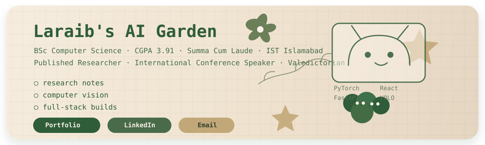

<!-- ══════════════════════════════════════════════════════════
     LARAIB KHALID — GitHub Profile README
══════════════════════════════════════════════════════════ -->

<!-- ── HEADER ───────────────────────────────────────────── -->

 

<!-- ── NAME (UPDATED) ───────────────────────────────────── -->
<h1 align="center">Hi  I'm Laraib Khalid</h1>

---

<!-- ── ABOUT ─────────────────────────────────────────────── -->

## `$ whoami`

<table width="92%">
<tr>
<td width="58%" align="left" valign="middle">

<pre><code class="language-python">laraib = {
    "name": "Laraib Khalid",
    "role": "AI/ML Engineer",
    "track": "Computer Vision + Full-Stack",
    "location": "Islamabad, Pakistan",
    "education": "BSc CS · IST · CGPA 3.91",
    "honours": "Gold Medalist · Valedictorian",
    "published": "ICASET 2025 · Oman",
    "focus": "DL · CV · UAVs · Web Apps",
    "stack": "PyTorch · FastAPI · React",
}</code></pre>

</td>
<td width="42%" align="center" valign="middle">
  
</td>
</tr>
</table>

---

<!-- ── EXPERIENCE ──────────────────────────────────────────── -->

## Experience

| Period | Role | Organisation |
|--------|------|--------------|
| Oct 2025 – Feb 2026 | **CS Instructor** (IB Curriculum) | Roots Ivy International School |
| Dec 2024 – Nov 2025 | **Research Assistant** · UAV Detection, YOLO, FastAPI | National Centre for Physics (AiTEC) |
| Feb 2025 – Mar 2025 | **Research Assistant & Software Engineer** · AWS SES, AI Prompting | ItCoderz |
| Jul 2024 – Aug 2024 | **Intern** · Radiation Data Analysis, Cybersecurity | Pakistan Nuclear Regulatory Authority |
| Feb 2024 – Sep 2024 | **Software Intern** · React.js, Jira, Unit Testing | NAXXA Consulting |
| Jul 2023 – Sep 2023 | **Research Assistant** · Bibliometric Analysis, LaTeX | Institute of Space Technology |

---

<!-- ── RESEARCH & ACHIEVEMENTS ──────────────────────────────── -->

## Research & Achievements

> 🎤 **Presented at ICASET 2025** — *"SkyScan: Optimized YOLO Architecture with SAHI for Aerial Surveillance"*  
> Military Technological College, Muscat, Oman

| 🏆 | Achievement |
|----|------------|
| 🥇 | **1st Place** — BizzTech Speed Programming Competition 2024 |
| 🥇 | **Winner** — Women in Tech Fest 2024 Programming Competition |
| 🥉 | **3rd Place** — AI Innovative Ideas Competition 2025 (AITeC, NCP) |
| 🏅 | **Presidential Gold Medal** — Academic Excellence, IST |
| 🎓 | **Valedictorian** & IST Scholarship Recipient |

---

<!-- ── FEATURED PROJECTS ───────────────────────────────────── -->

## Featured Projects

<table>
<tr>
<td width="50%" valign="top">

### 🛸 SkyScan
**UAV Real-Time Detection Pipeline**
Re-engineered YOLO with P3–P6 multi-scale heads, CBAM attention, C3 modules & SAHI for small-object detection. Deployed via **FastAPI** on VisDrone dataset.

`YOLO` `CBAM` `FastAPI` `SAHI` `Python`

</td>
<td width="50%" valign="top">

### 🛰 Satellite Image Segmentation
Pixel-level segmentation of satellite imagery using **U-Net** with one-hot encoding. Interactive front-end via **Gradio**.

`U-Net` `PyTorch` `OpenCV` `Gradio`

</td>
</tr>
<tr>
<td width="50%" valign="top">

### 🎓 AI Attendance & Performance Tracker
Facial recognition–based attendance system with student + admin portals. Built with OOP principles.

`OpenCV` `Python` `Computer Vision` `OOP`

</td>
<td width="50%" valign="top">

### 🗓 IST Event Management Portal
Full-stack university event portal with unit & integration testing, security hardening.

`Django` `Python` `HTML/CSS` `Unit Testing`

</td>
</tr>
<tr>
<td width="50%" valign="top">

### 🌐 LinguaMate
Universal voice translation tool — real-time multilingual speech processing.

`Python` `NLP` `Speech API`

</td>
<td width="50%" valign="top">

### 🧘 Vita Mind
Health app concept with Biometric Stress Assessment & VR Meditation. Prototyped in Figma.

`Figma` `UX Design` `Health Tech`

</td>
</tr>
</table>

---

<!-- ── TECH STACK ──────────────────────────────────────────── -->

## Tech Stack

**Languages**

**AI / ML / Deep Learning / CV**

**LLMs / GenAI**

**Web & APIs**

**Tools & Cloud**

---

<!-- ── TECHNICAL FOCUS ──────────────────────────────────────── -->

## Technical Focus

<table>
<tr>
<td width="50%" valign="top">

### AI / ML / Deep Learning

`PyTorch` `TensorFlow` `Keras` `scikit-learn` `NumPy` `Pandas` `OpenCV` `YOLO` `SAHI`

</td>
<td width="50%" valign="top">

### LLMs / GenAI

`Hugging Face` `Transformers` `LangChain` `OpenAI` `NLP` `Research Workflows`

</td>
</tr>
<tr>
<td width="50%" valign="top">

### Web Apps / APIs

`React` `React Native` `FastAPI` `Django` `JavaScript` `SQL` `MySQL` `HTML/CSS`

</td>
<td width="50%" valign="top">

### Engineering Tools

`Git` `AWS SES` `Jira` `Figma` `Webflow` `LaTeX` `Gradio`

</td>
</tr>
</table>

---

<!-- ── CONNECT ──────────────────────────────────────────────── -->

## Let's Connect

&nbsp;

&nbsp;

  

  Open to <strong>research collaborations</strong>, <strong>AI/ML roles</strong>, and <strong>full-stack engineering</strong> opportunities.

 

